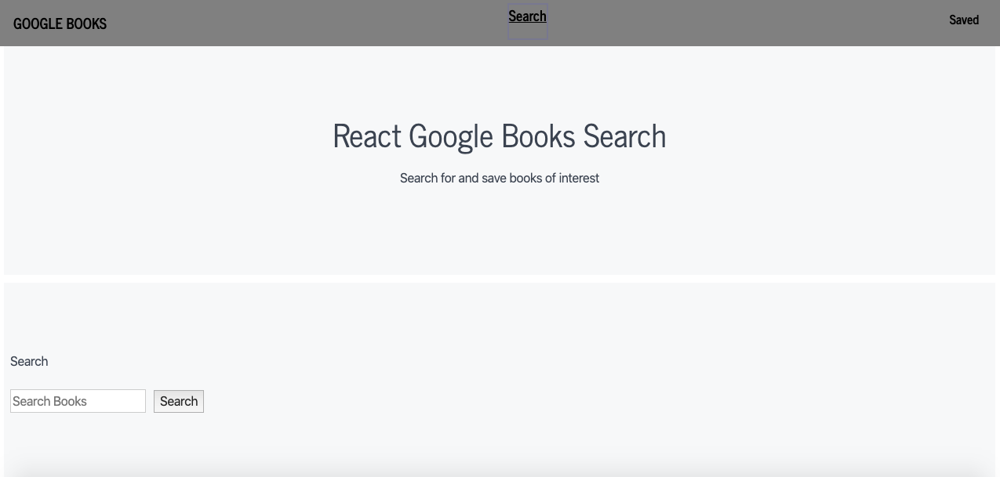

# React Google Books
## Description: 
Allows people to look up and save books from Google Books API
## Table Of Contents:
* Usage
* Technology Used/Badges

## Usage:
Simply click on search to search for books and the only thing that works is the api, "flowers" is already in the api url that's why is reanders it, input box doesn't work.

## Technologies Used/Bagdes: 

## Lisence:  
MIT
